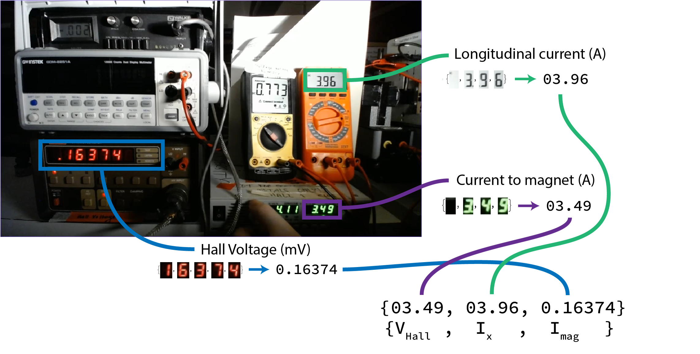

# Classifying digital sensor output for high-frequency analysis

Data folder: https://drive.google.com/drive/folders/1pC75FXOul2uoGasYzbTCHz2cFIZ2t4G-?usp=sharing

This particular video file serves as a good first example for writing code: https://drive.google.com/file/d/1bbmaET_IG67DgVBaaUAr0IvQkl1wS55F/view?usp=sharing
It is one of the experimental runs with a thin copper sheet inserted in the apparatus.

